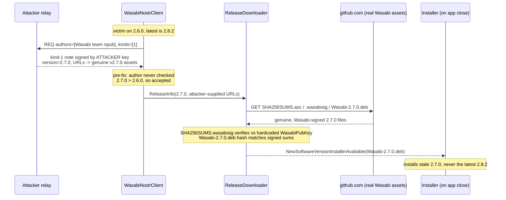

# poc-wasabi-stale-version

Wasabi's update path will download, verify, and stage for install a genuinely
Wasabi-signed release that is **older than the latest** (stale-version pinning /
update suppression).

`poc-nostr-forgery` proved the client ACCEPTS an unauthenticated announcement. This repo
shows the payoff for the one asset class the installer signature gate does not stop: a
real, Wasabi-signed release that is not the newest one. If an announcement names a real
release `V` and points at the authentic GitHub assets for `V`, the production
`ReleaseDownloader` verifies the genuine `SHA256SUMS.wasabisig` against the hardcoded
`WasabiPubKey`, matches the installer hash, and stages `V`. On exit
`WalletWasabi.Fluent.Desktop/Program.cs` runs it through `Installer.StartInstallingNewVersion`
when `DownloadNewVersion` is on (the default).

## Flow

Victim runs 2.6.0. Latest is 2.8.2. The attacker gets the client to install the older
2.7.0, a genuinely Wasabi-signed build, and every signature gate passes.



The announced version can only be greater than the victim's current one
(`releases.Where(x => x.Version > currentVersion)`), so this pins the victim onto a stale
signed release that sits below the latest, it does not roll the binary back below what
they run. Delivery over Nostr worked without the team key because this targets the pre-fix
commit `154c4a5`; the signer-identity check (PR #15005, v2.8.2) drops the attacker-signed
note, after which the same pinning needs a replayed genuine team note or a team-key
compromise. The download / verify / install chain above is unchanged by that fix.

## How to run

Requires .NET SDK 10 and internet access (the PoC downloads the genuine Wasabi 2.7.0
release assets from GitHub on first run).

1. Check out the audited WalletWasabi at commit `154c4a5` as a sibling directory named
   `WalletWasabi`, next to this repo:

   ```
   git clone https://github.com/WalletWasabi/WalletWasabi
   cd WalletWasabi && git checkout 154c4a5 && cd ..
   ```

   Layout expected by `Poc/Poc.csproj`:

   ```
   <parent>/WalletWasabi/WalletWasabi/WalletWasabi.csproj
   <parent>/poc-wasabi-stale-version/
   ```

2. Run:

   ```
   dotnet run --project FakeRelay   # terminal 1 - malicious relay
   dotnet run --project Poc         # terminal 2 - Wasabi update service, wired as in Global.cs
   ```

## Expected output

```
[POC] victim currentVersion = 2.6.0; running the production updater once...
INF | UpdateManager.cs:78  | New version found: 2.7.0
[POC] NewSoftwareVersionAvailable: version=2.7.0 upToDate=False readyToInstall=False
INF | UpdateManager.cs:135 | Trying to download new version.
INF | UpdateManager.cs:158 | Installer downloaded to: /tmp/wasabi-installer-2.7.0/Wasabi-2.7.0.deb
INF | UpdateManager.cs:164 | Installer verified successfully
[POC] NewSoftwareVersionAvailable: version=2.7.0 upToDate=False readyToInstall=True
[POC] NewSoftwareVersionInstallerAvailable: /tmp/wasabi-installer-2.7.0/Wasabi-2.7.0.deb
[POC] staged 69487660 bytes, sha256 = 91a1e9b21caf317104c1f50a4a0c0e7810d29b221d060fd77274afc690ecaed8
[POC] MATCH: sha256 equals the Wasabi-signed SHA256SUMS entry for Wasabi-2.7.0.deb
```

The victim was on 2.6.0 and is now staged to install 2.7.0 while 2.8.2 is the latest. As an
independent check the PoC re-reads the ECDSA-verified `SHA256SUMS.asc` the client itself
downloaded and confirms the staged `.deb`'s sha256 equals the signed entry for its filename,
so the artifact is provably the genuine Wasabi 2.7.0 build. The production code had already
verified `SHA256SUMS.wasabisig` against the hardcoded `WasabiPubKey` and matched the hash
before staging. The PoC does **not** launch the installer.

## Structure

- `FakeRelay/` — a small NIP-01 WebSocket relay. It answers the client's `REQ` with an
  event validly signed by an ATTACKER key (not the team key), announcing the real 2.7.0
  with every asset URL pointing at the authentic GitHub files.
- `Poc/` — references the audited WalletWasabi (`ProjectReference`, commit `154c4a5`) and
  wires the production `UpdateManager` + `ReleaseDownloader` exactly as
  `WalletWasabi.Client/Global.cs:ConfigureWasabiUpdater` does, with the victim's current
  version set to 2.6.0.

## Suggested fixes

1. Reject an announced version not greater than the latest release the client knows of
   (a version ceiling against the newest release, not just against the running one).
   `UpdateManager` currently accepts any version above the running one.
2. Add announcement freshness (reject stale `created_at`) to blunt replay of old genuine
   notes.
3. (Already shipped in v2.8.2) verify the announcement's signer is the Wasabi team key.
